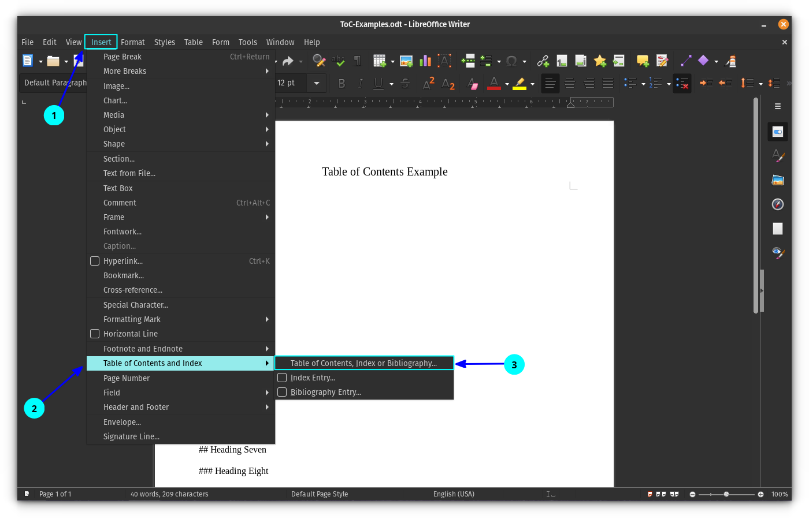
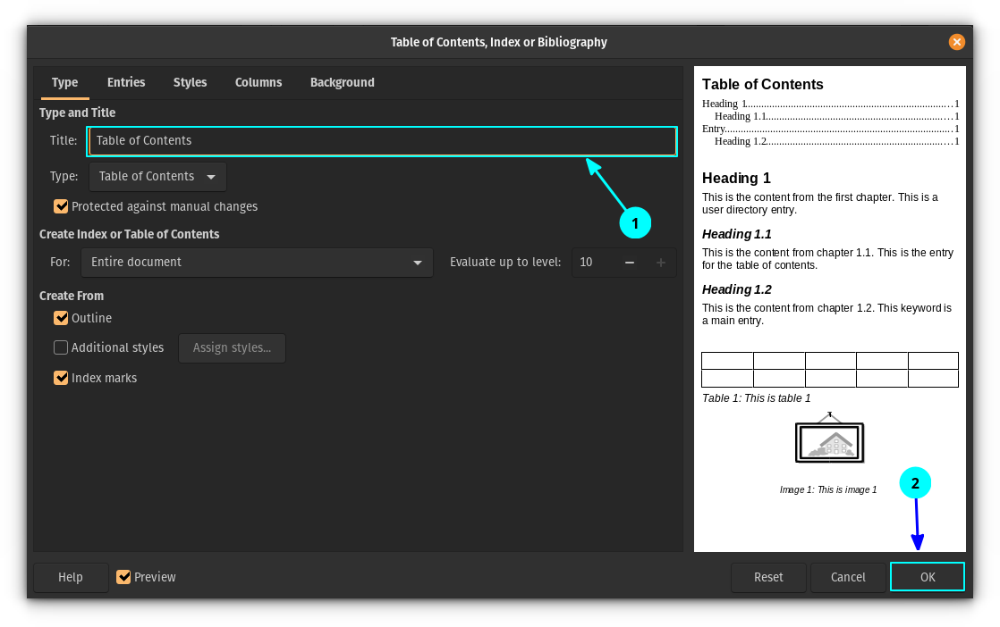
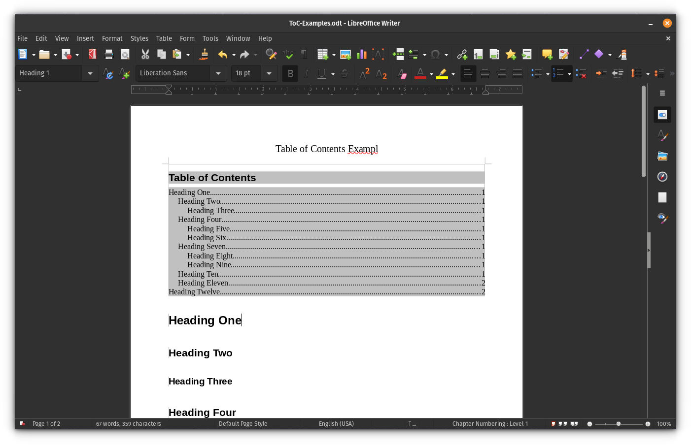

# Adding a table of contents in LibreOffice

The table of contents will be generated based on the headings you have. That means a level one heading will be on top; level two and three follows as subsections of the Level one heading and so on.

First, you need to place the cursor on the position where you want to add the Table of Contents because the ToC (table of contents) will be added depending on where your cursor is.

Once you are at the right place, click on the Insert button and select Table of Contents and Index:

This will open a dialog box for tweaking the table of contents. For the default ToC, select a name you want for the heading and then press OK.

Remember to untick `Protect against manual changes` to have an editable TOC

This will add a simple table of contents for your entire document based on the headings.

{💡}The elements in the table of contents are clickable. If you want to go to a particular heading, hold down the CTRL key and then click on the item you want to go.

